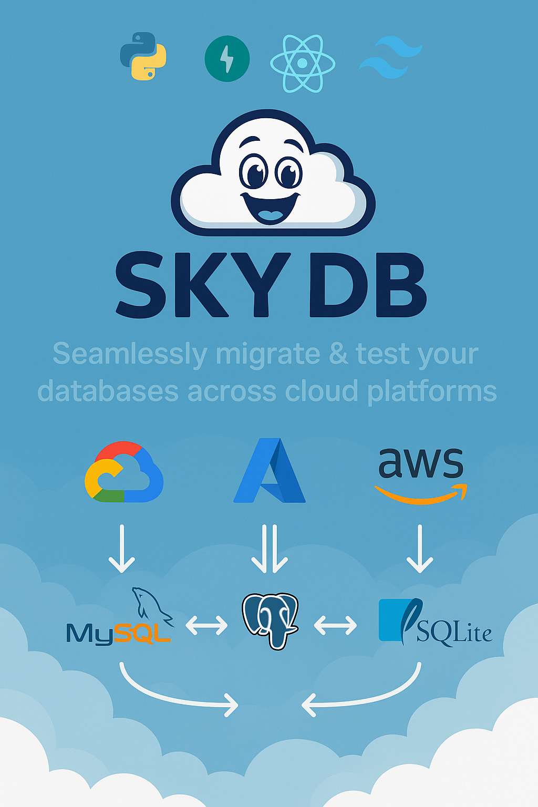

# SkyDB ☁️ – Cloud SQL Benchmarking Framework

> Seamlessly migrate & test your databases across cloud platforms.

SkyDB helps organizations make informed, data-driven decisions when considering whether to migrate from **MySQL to PostgreSQL**.
The system uploads SQL dumps, automatically deploys both database engines to AWS RDS, runs a suite of realistic SQL benchmark tests, and presents the results in a visual dashboard.

---


---

## 🚧 Project Status

⚠️ **This project is currently in active development.**

Some components are functional and tested internally, but the public deployment, installation scripts, and self-serve usage are **not yet available**.  
We plan to make it fully open and easy-to-use **soon**. Stay tuned by starring the repository!

---

## 🧠 What SkyDB Does

1. Upload your own `schema.sql` and `data.sql` files
2. SkyDB parses the schema and deploys:
   - **MySQL RDS** (raw SQL)
   - **PostgreSQL RDS** (via `pgloader` + `pg_dump`)
3. It executes selected benchmark plans on both:
   - Includes: SELECT, JOIN, GROUP BY, AGGREGATION, WINDOW, FILTERS
   - Supports up to 30 concurrent users (stress/load tests)
4. Execution metrics collected:
   - avg, p95, stddev
5. Displayed through a clean **React UI** (comparison cards, charts, history)

---

## 🖼️ App Preview

You can also explore our concept in this flow diagram:

```
Upload → Schema Analysis → Deploy to AWS (MySQL & PG) → Benchmark → UI
```

---

## 📁 Project Structure

```
LastYearProject/
│
├── main/                 # Python FastAPI backend
│   ├── api/              # Route controllers
│   ├── config/           # Configuration files
│   ├── core/             # Core logic: benchmarks, schema, plans
│   ├── data/             # SQL file handling
│   ├── services/         # External services (RDS, Supabase)
│   ├── utils/            # Helper functions
│   └── app.py            # Entry point
│
├── react-ui/             # React 18 frontend
│   ├── public/
│   ├── src/
│   ├── tailwind.config.js
│   ├── postcss.config.js
│   └── .env
│
├── output.sql            # Example SQL export (for PostgreSQL)
└── README.md
```

---

## 📊 What It’s *Not* (yet)

- ❌ No real-time monitoring or replication
- ❌ Does not support Oracle / MSSQL 
- ❌ No user authentication (planned)
- ❌ Does not offer optimization tips for specific queries

---

## 🗺️ Roadmap Highlights

- [ ] Support for **SQLite**, **Google Cloud**, and **Azure**
- [ ] S3 upload support for large files
- [ ] Cost estimation models for RDS usage
- [ ] User authentication and role management
- [ ] Deployment on an AWS EC2 instance

---

## 🧪 Example Workflow (Planned UI Flow)

1. User uploads SQL files
2. Backend deploys RDS instances
3. Queries are executed in parallel
4. Results stored and visualized
5. User gets a detailed, actionable comparison

---

## 👨‍💻 Contributors

- **Lior Erez** 
- **Niv Ishay** 

---

## 📄 License

MIT License – use freely, contribute kindly.

---

## 🙏 Credits

- [pgloader](https://github.com/dimitri/pgloader)
- [Supabase](https://supabase.com/)
- [FastAPI](https://fastapi.tiangolo.com/)

